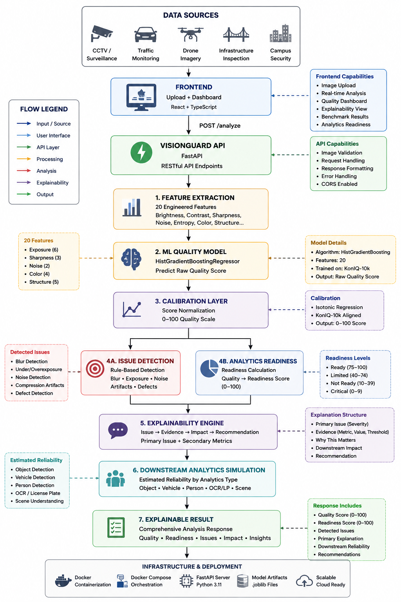
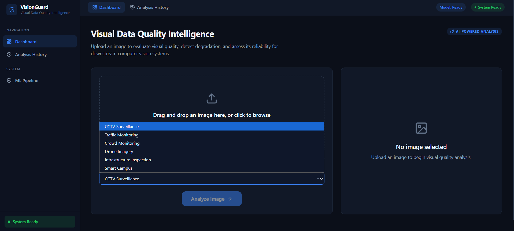
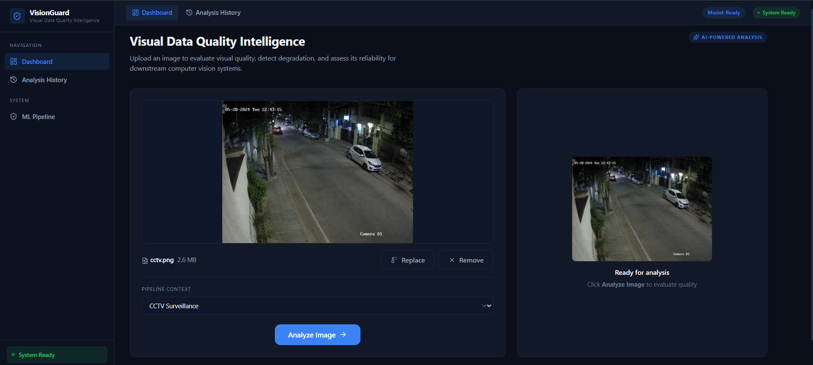
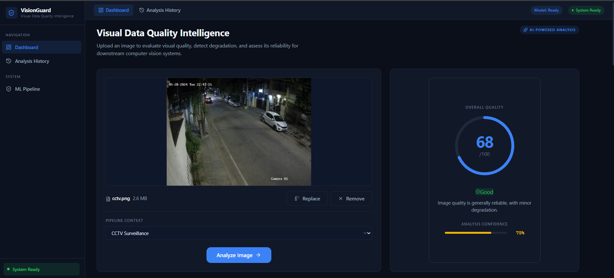
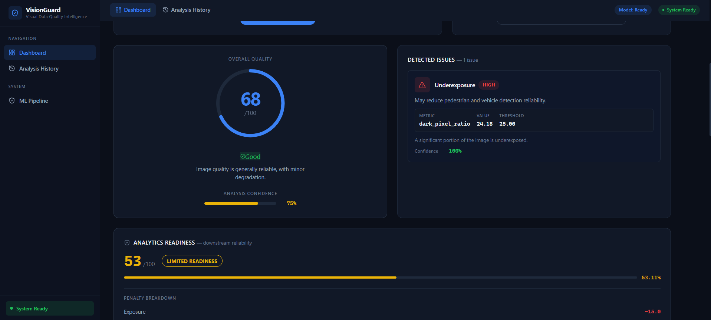
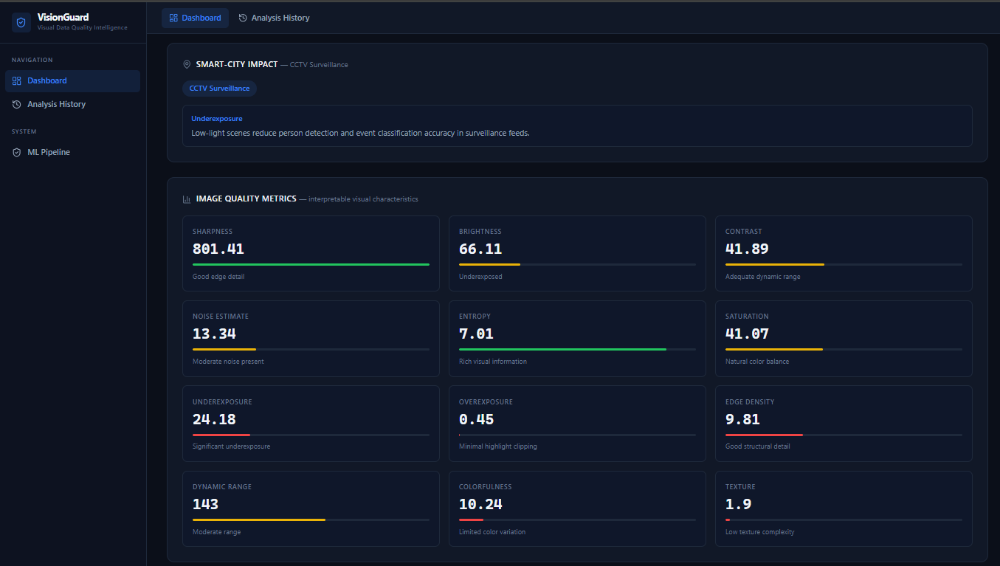
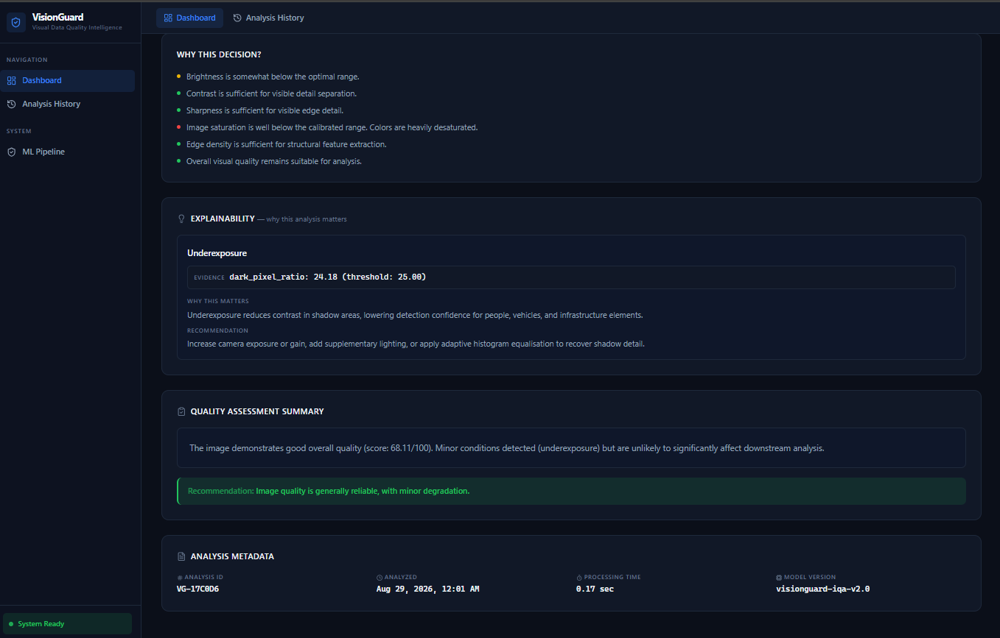

# VisionGuard

### AI-Powered Image Quality & Defect Detection

VisionGuard is a full-stack computer-vision application that evaluates image quality, detects visual degradation, estimates downstream analytics readiness, and provides explainable quality decisions.

[🌐 Live Demo](https://visionguard-frontend-5nwk.onrender.com) ·
[⚙️ Backend API](https://visionguard-backend-pbts.onrender.com) ·
[❤️ API Health](https://visionguard-backend-pbts.onrender.com/api/health)

Built for the **AI-Powered Image Quality & Defect Detection Technical Assessment**.

---

## Architecture



The architecture diagram above shows the complete system from image sources through the VisionGuard API, feature extraction, ML quality model, calibration, issue detection, analytics readiness, explainability, and final results.

---

## Key Features

- AI/ML-based image quality scoring
- Blur / insufficient sharpness detection
- Underexposure detection
- Overexposure detection
- Image noise detection
- Severe degradation / corruption detection
- Potential visual defect detection
- Analytics Readiness Score
- Estimated downstream analytics reliability
- Issue-driven explainability
- Analysis history
- REST API
- Image validation and error handling
- React + TypeScript dashboard
- Automated test suite
- Docker / Docker Compose support

---

## AI / ML Model

VisionGuard uses a **HistGradientBoostingRegressor** trained on **16,300 images** from:

- KADID-10K
- KonIQ-10K

The model uses **20 engineered image-quality features** covering exposure, sharpness, contrast, noise, color, texture, and structural information.

### Feature Set

```text
brightness
contrast
sharpness
saturation
edge_density
noise_estimate
entropy
colorfulness
luminance_p10
luminance_p90
dark_pixel_pct
bright_pixel_pct
luminance_median
gradient_magnitude
dynamic_range
percentile_range
noise_to_signal
channel_std
hue_entropy
texture_complexity
```

### Training / Evaluation Split

| Split | Samples | Percentage |
|---|---:|---:|
| Train | 11,414 | 70% |
| Validation | 2,443 | 15% |
| Test | 2,443 | 15% |

Calibration uses **Isotonic Regression fitted only on the validation set**. The test set remains completely untouched for final evaluation.

**Model version:** v4.0.0  
**Random seed:** 42

---

## Model Evaluation

Final metrics are calculated on the unseen held-out test set.

| Metric | v4.0 |
|---|---:|
| MAE | **13.27** |
| RMSE | **16.91** |
| R² | **0.54** |
| Spearman Correlation | **0.71** |

### Baseline vs Feature-Engineered Model

| Metric | Baseline | v4.0 | Improvement |
|---|---:|---:|---:|
| MAE | 16.60 | **13.27** | **20.0% lower** |
| RMSE | 20.32 | **16.91** | **16.8% lower** |
| R² | 0.33 | **0.54** | **63.1% higher** |
| Spearman | 0.55 | **0.71** | **29.0% higher** |

The improvement was obtained through feature engineering and model selection rather than changing the evaluation methodology.

---

## Feature Importance

The model relies primarily on measurable image-quality characteristics such as sharpness, structural information, exposure, color, and noise.

| Rank | Feature | Importance |
|---:|---|---:|
| 1 | Sharpness | 0.952 |
| 2 | Gradient Magnitude | 0.282 |
| 3 | Colorfulness | 0.157 |
| 4 | Entropy | 0.140 |
| 5 | Saturation | 0.092 |
| 6 | Noise-to-Signal | 0.085 |
| 7 | Edge Density | 0.083 |
| 8 | Hue Entropy | 0.072 |
| 9 | Luminance P10 | 0.069 |
| 10 | Dark Pixel % | 0.068 |

Feature importance was calculated using permutation importance on validation data.

---

## Computer Vision Quality Detection

| Requirement | Detection Method |
|---|---|
| Blur / Insufficient Sharpness | Laplacian variance + edge density |
| Underexposure | Dark-pixel percentage + brightness |
| Overexposure | Bright-pixel percentage + brightness |
| Image Noise | Laplacian-based noise estimation |
| Severe Degradation | Multi-signal degradation analysis |
| Potential Visual Defect | Abnormal feature combinations |
| Additional Quality Characteristics | Contrast, saturation, entropy, dynamic range, structure |

---

## Smart-City Benchmark

VisionGuard was evaluated on **600 images** across five smart-city contexts.

| Context | Images | Avg Quality | Avg Readiness |
|---|---:|---:|---:|
| CCTV Surveillance | 100 | 48.73 | 45.97 |
| Drone Imagery | 200 | 38.00 | 23.29 |
| Infrastructure Inspection | 100 | 48.34 | 28.53 |
| Low-Light Evaluation | 100 | 25.61 | 0.59 |
| Traffic Monitoring | 100 | 55.61 | 42.28 |

> **Important:** Average Quality and Average Readiness are benchmark dataset statistics, not model accuracy metrics. ML predictive performance is reported separately using MAE, RMSE, R² and Spearman correlation on the held-out test set.

---

## Controlled-Condition Evaluation

The system was also evaluated using controlled image-quality conditions to verify that different visual conditions produce different system decisions.

| Condition | Quality | Readiness | Status | Primary Issue |
|---|---:|---:|---|---|
| Clean | 60.8 | 45.8 | LIMITED READINESS | Underexposure |
| Blurred | 13.7 | 0.0 | CRITICAL / REJECT | Severe Blur |
| Underexposed | 24.7 | 0.0 | CRITICAL / REJECT | Severe Blur |
| Overexposed | 66.7 | 21.7 | NOT READY | Overexposure |
| Noisy | 29.6 | 0.0 | CRITICAL / REJECT | Underexposure |
| Severe Degradation | 13.7 | 0.0 | CRITICAL / REJECT | Underexposure |

These values are generated by the actual VisionGuard pipeline rather than manually assigned.

---

## Analytics Readiness

The **Analytics Readiness Score** estimates whether an image is suitable for downstream computer-vision processing.

VisionGuard additionally provides an **Estimated Downstream Reliability** assessment for relevant analytics.

| Analytics | Example Reliability |
|---|---|
| Object Detection | HIGH |
| Vehicle Detection | MEDIUM |
| Person Detection | MEDIUM |
| OCR / License Plate | LOW |
| Infrastructure / Defect Detection | MEDIUM |

The reliability assessment is derived from detected image-quality conditions.

> **Important:** These are estimated reliability assessments, not measured downstream model accuracy. VisionGuard does not execute or evaluate YOLO, OCR, or other downstream models.

---

## Explainability

VisionGuard provides issue-driven explanations using the hierarchy:

```text
PRIMARY ISSUE
      ↓
EVIDENCE
      ↓
WHY THIS MATTERS
      ↓
DOWNSTREAM IMPACT
      ↓
RECOMMENDATION
```

Example:

```text
PRIMARY ISSUE
Underexposure — HIGH

EVIDENCE
Dark pixel ratio: 24.18%
Threshold: 25.00%

WHY THIS MATTERS
Underexposure reduces contrast in shadow areas,
which can affect downstream detection.

DOWNSTREAM IMPACT
Person Detection: MEDIUM
Vehicle Detection: MEDIUM
OCR / License Plate: LOW

RECOMMENDATION
Improve camera exposure or illumination.
```

Evidence values and thresholds are generated from the actual image analysis and issue detector.

---

## Performance

Measured full-pipeline inference:

| Metric | Result |
|---|---:|
| Mean latency | ~112 ms |
| P95 latency | ~137 ms |

The model and calibration artifacts are loaded once and reused during inference.

---

## Frontend

The React + TypeScript dashboard provides:

- Image upload and preview
- Quality score
- Readiness score
- Detected issues
- Severity and confidence
- Quality metrics
- Smart-city impact
- Explainability
- Recommendations
- Analysis history
- Loading state
- API error state
- Empty state

---

## Screenshots

### Dashboard



### Image Analysis



### Detected Issues



### Analytics Readiness



### Explainability



### Analysis Metadata / History



---

## Backend API

Built with **FastAPI**.

### Main Endpoints

| Method | Endpoint | Purpose |
|---|---|---|
| POST | `/api/analyze` | Analyze an uploaded image |
| GET | `/api/health` | Backend health/status |
| GET | `/api/model-info` | Model metadata |

Example:

```bash
curl -X POST http://localhost:8000/api/analyze \
  -F "file=@sample.jpg"
```

Health check:

```bash
curl http://localhost:8000/api/health
```

The API validates uploaded images and handles invalid images, unavailable models, and request errors without exposing internal implementation details to the client.

---

## Testing

The project includes automated tests covering:

- Feature extraction
- ML inference
- Calibration
- Quality scoring
- Issue detection
- Scoring integrity
- API validation
- Error handling
- Analytics readiness
- Explainability
- Smart-city benchmark evaluation
- Frontend/API data consistency

Run:

```bash
python -m pytest -v
```

Current test suite:

**321 tests passing**

---

## Docker

VisionGuard supports containerized deployment using Docker Compose.

```bash
docker compose up --build
```

The deployment includes:

- Frontend container
- Backend container
- ML model artifacts
- Environment configuration
- Backend health check
- Frontend → backend communication

---

## Project Structure

```text
visionguard/
├── backend/
│   ├── apps/
│   ├── models/
│   └── tests/
├── frontend/
├── ml/
├── benchmark/
│   └── smart_city/
├── datasets/
├── docs/
│   └── screenshots/
├── docker-compose.yml
└── README.md
```

---

## Limitations

- R² = 0.54, so the model does not explain all perceptual quality variance.
- The model uses engineered image-quality features rather than a deep neural network.
- Training data is primarily general-purpose image-quality data, creating a potential smart-city domain gap.
- Issue detectors do not have independently labelled ground truth for every issue type.
- Smart-city benchmark scores are descriptive dataset statistics, not model accuracy.
- Downstream analytics reliability is estimated rather than experimentally measured.
- Evaluation currently uses a fixed train/validation/test split rather than cross-validation.

---

## Assessment Coverage

VisionGuard covers the major assessment requirements including:

- Computer vision feature extraction
- AI/ML model training
- Model evaluation using MAE, RMSE, R² and correlation
- Calibration
- Image quality scoring
- Required quality issue detection
- Smart-city positioning
- Analytics Readiness Score
- Explainability
- Downstream analytics impact estimation
- Image upload and preview
- REST API
- Validation and error handling
- Analysis history
- Frontend dashboard
- Automated testing
- Docker / Docker Compose
- Health monitoring
- Technical documentation

---

## License

Developed as part of an internship technical assessment.
